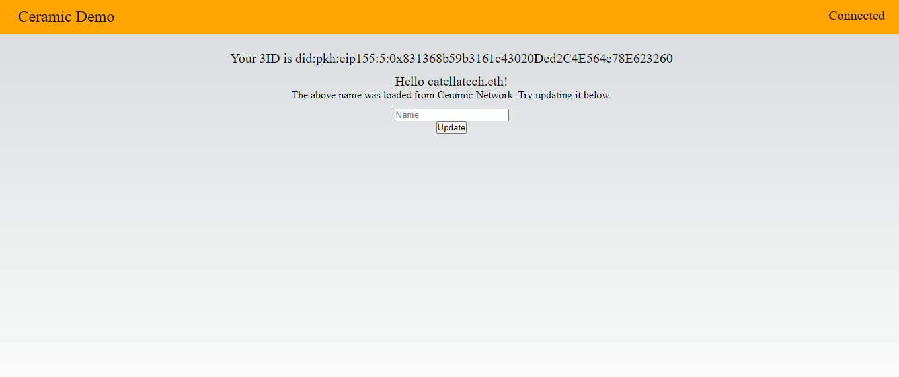

<h1 aling="center">Ceramic Network ✨📚 </h1>

  <a href="https://github.com/gab0071" target="_blank">
    
  </a>
 

  <br>
  <br>



Ceramic is a `decentralized data network`, that allows for building composable Web3 applications. Since Ceramic decentralizes application databases, application developers can reuse data across applications and make them automatically interoperable.

<h2> So... What does Ceramic do?🤔</h2>
Ceramic is building:

1. A generalized data protocol
2. where data can be modified only by the owner
3. with high volume data processing
4. with global data availability and consistency
5. with support for fast querying
6. with interoperable data across applications
7. and community governance

This is a lot. This is also why Ceramic can be tricky to define on it's own. After all, just like Ethereum, it is a generalized protocol, albeit for data. 

dApps can use Ceramic's data protocol to `build standardized multi-chain reputation systems`. A user can connect multiple wallets to their decentralized identity, belong from different blockchains, and data can be written to and updated from the user's decentralized data store on Ceramic.

Therefore, regardless of what chain and dApp the user is using, they can carry around their reputation system with them.

Overall, Ceramic is an exciting protocol with a lot of potential for building Web3 applications that require decentralized, interoperable data. It is well-suited for developers who are looking to build applications that can take advantage of its fast querying and high volume data processing capabilities, as well as its support for global data availability and consistency.

We build a basic demo here.
<hr>
<h2> Installing / Getting started </h2>

```bash
# Clone this project
$ git clone https://github.com/gab0071/Ceramic

# Access
$ cd Ceramic

# Install dependencies
$ npm install

``` 

<h2>Commands</h2>

- $ ``` npx create-next-app@latest ceramic-tutorial```
- $ ```npm run dev ``` 
<strong>Now go to `http://localhost:3000`, your app should be running </strong>🤘

Open up a terminal pointing at `ceramic-tutorial directory` and execute this command:
- $  ```npm install @self.id/react @self.id/web key-did-provider-ed25519```
- $ ``` npm install web3modal ethers```


<h2> Technologies / Built With </h2>

- Next.js
- Ethers.js
- Web3Modal
- <a href="https://ceramic.network/">Ceramic Network</a>
<hr>
Note🚨 ➡ Hopefully this could give you a sneak peek into how to use Ceramic, and help you gain an understanding of why Ceramic is important.
<br>
<br>

<p align="center">
<br/>
  Made with ❤️ by <b>catellaTech</b>.
</p>